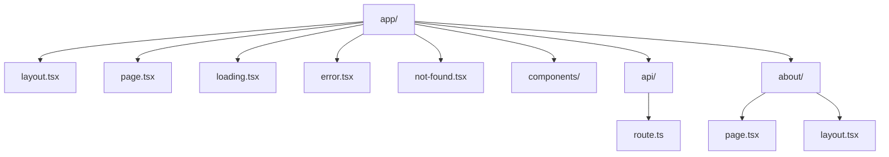
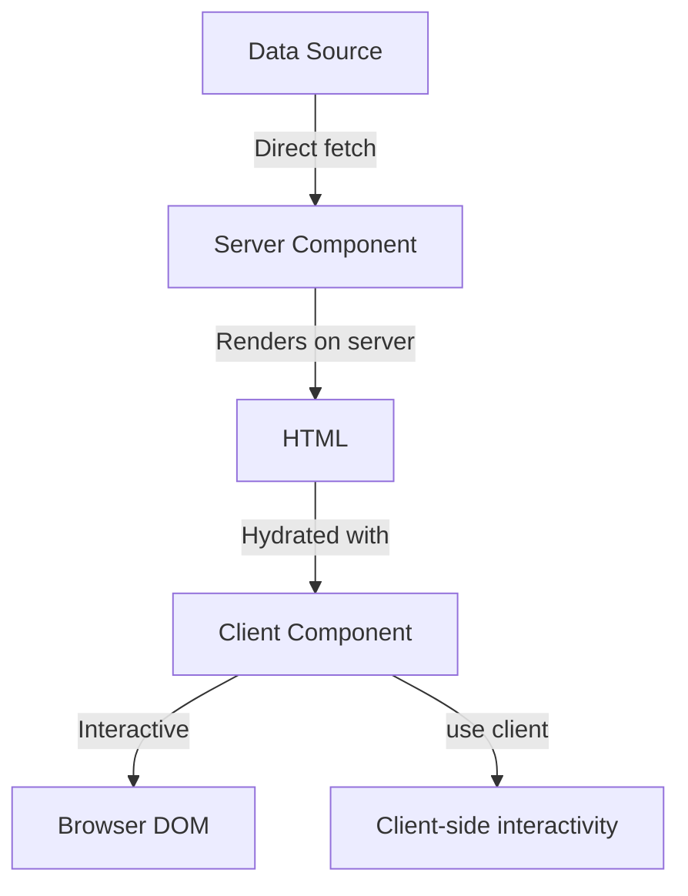

# Design Document: Next.js 15+ and Tailwind CSS v4 Upgrade

## Overview

This design document outlines the approach for upgrading the current Next.js project to use Next.js 15+ with the App Router architecture and Tailwind CSS version 4. The upgrade will be implemented in a way that maintains all existing functionality while leveraging the new features and improvements offered by these updated technologies.

## Architecture

The project will continue to use the same overall architecture but with the following key changes:

1. **Routing System**: Transition from any legacy Pages Router patterns to the App Router architecture, which uses a file-system based routing approach with nested layouts and co-located data fetching.

2. **Component Structure**: Proper imation of Server and Client Components, with clear boundaries between them using the "use client" directive where appropriate.

3. **Data Fetching**: Update data fetching methods to use the App Router's recommended patterns, including Server Components for direct data fetching and React Server Actions for mutations.

4. **Styling System**: Continue using Tailwind CSS but upgraded to version 4, with updated configuration and potentially new utility classes.

## Components and Interfaces

### App Router Structure

The App Router uses a directory-based routing system where:

- `app/page.tsx` - The main entry point (home page)
- `app/layout.tsx` - The root layout that wraps all pages
- `app/[route]/page.tsx` - Individual route pages
- `app/[route]/layout.tsx` - Layouts specific to routes
- `app/components/` - Shared components used across multiple pages

Based on the current project structure, we already have the App Router architecture in place. We'll need to ensure all components are properly designated as Server or Client Components.

### Server vs. Client Components

- **Server Components (Default)**: Used for components that don't need client-side interactivity, data fetching, or access to browser APIs.
- **Client Components**: Marked with `"use client"` directive at the top of the file, used for components that need interactivity, hooks, or browser APIs.

### Tailwind CSS v4 Integration

Tailwind CSS v4 will be integrated through:

1. Updated `postcss.config.mjs` file
2. Potential updates to any custom theme configuration
3. Migration of any deprecated utility classes to their v4 equivalents

## Data Models

The existing data models will remain unchanged, but the way data is fetched and mutated will be updated to align with Next.js 15+ best practices:

1. **Server Components**: Will fetch data directly without the need for hooks
2. **React Server Actions**: Will be used for form submissions and data mutations
3. **Route Handlers**: Will be used for API endpoints in the `app/api` directory

## Error Handling

Error handling will be enhanced using the App Router's built-in error handling mechanisms:

1. **Error Boundaries**: Implement `error.tsx` files alongside route segments to catch and display errors
2. **Not Found Pages**: Implement `not-found.tsx` files for custom 404 pages
3. **Loading States**: Implement `loading.tsx` files for showing loading states during navigation and data fetching

## Testing Strategy

The testing strategy will involve:

1. **Unit Tests**: Update any component tests to account for Server vs. Client Components
2. **Integration Tests**: Ensure that the App Router navigation works as expected
3. **Visual Regression Tests**: Verify that the UI appearance remains consistent after the Tailwind CSS v4 upgrade
4. **Performance Testing**: Compare performance metrics before and after the upgrade

## Configuration Updates

### Next.js Configuration

The `next.config.ts` file will be updated to:

```typescript
import type { NextConfig } from "next";

const nextConfig: NextConfig = {
  images: {
    domains: ["encrypted-tbn0.gstatic.com"],
    formats: ["image/avif", "image/webp"],
  },
  compress: true,
  poweredByHeader: false,
  reactStrictMode: true,
  // Remove experimental.optimizeCss as it's now built-in or handled differently
};

export default nextConfig;
```

### PostCSS Configuration

The `postcss.config.mjs` file will be updated to:

```javascript
const config = {
  plugins: {
    tailwindcss: {},
    autoprefixer: {},
  },
};
export default config;
```

### Tailwind CSS Configuration

If a `tailwind.config.js` or similar file exists, it will be updated to be compatible with Tailwind CSS v4. If it doesn't exist, a new one will be created with appropriate settings.

## Migration Path

The migration will follow these high-level steps:

1. Update dependencies in `package.json`
2. Update configuration files
3. Verify the App Router structure is correctly implemented
4. Update components to properly use Server and Client Component patterns
5. Update styling to accommodate any Tailwind CSS v4 changes
6. Test thoroughly to ensure all functionality works as expected

## Diagrams

### App Router Structure



### Server vs. Client Component Flow



## Performance Considerations

1. **Server Components**: Leverage Server Components for reduced JavaScript bundle size
2. **Streaming**: Implement streaming where appropriate for improved perceived performance
3. **Image Optimization**: Continue using the Next.js Image component with proper sizing and formats
4. **Font Optimization**: Use the Next.js Font system for optimized font loading
5. **Tailwind CSS v4**: Take advantage of the performance improvements in Tailwind CSS v4

## Security Considerations

1. **Input Validation**: Ensure all user inputs are properly validated
2. **Authentication**: Update any authentication flows to work with the App Router
3. **API Routes**: Secure API routes with proper authentication and authorization checks
4. **Dependencies**: Keep all dependencies updated to their latest secure versions
